# UIU Research Portal

> **A production-ready academic research collaboration platform for United International University (UIU) students, faculty, and researchers.**

The **UIU Research Portal** streamlines the entire academic research lifecycle into a unified, secure web platform. Students and faculty can discover research partners, pitch ideas, coordinate projects via Kanban boards, publish papers, share datasets, communicate through real-time discussions, and track academic contributions and reputation.

---

## Table of Contents
1. [System Architecture](#system-architecture)
2. [Project Directory Structure](#project-directory-structure)
3. [Technology Stack](#technology-stack)
4. [Getting Started & Quick Launch](#getting-started--quick-launch)
5. [Default Seeded Demo Accounts](#default-seeded-demo-accounts)
6. [Frontend Client (`frontend/`)](#frontend-client-frontend)
7. [Backend REST API (`backend/`)](#backend-rest-api-backend)
8. [Complete API Endpoints Reference](#complete-api-endpoints-reference)
9. [Database Architecture (`database/`)](#database-architecture-database)
10. [Database Entity Relationship Diagram (ERD)](#database-entity-relationship-diagram-erd)
11. [Detailed Schema Specifications (30 Tables)](#detailed-schema-specifications-30-tables)
12. [Database Setup & Migrations](#database-setup--migrations)
13. [Security & Protection Mechanisms](#security--protection-mechanisms)
14. [Testing & Quality Assurance](#testing--quality-assurance)
15. [Docker & Containerized Deployment](#docker--containerized-deployment)
16. [Environment Variables Reference](#environment-variables-reference)
17. [License & Attribution](#license--attribution)

---

## System Architecture

The application implements a decoupled 3-tier architecture with a unified server gateway:

```text
                                  USER BROWSER / CLIENT
                                            │
                     ┌──────────────────────┴──────────────────────┐
                     │                                             │
               Static Assets & HTML                        Fetch API Requests
           (Pages, Vanilla CSS, JS)                      (JSON Payload, Bearer JWT)
                     │                                             │
                     └──────────────────────┬──────────────────────┘
                                            ▼
                           Unified HTTP Router (router.php)
                     ┌──────────────────────┴──────────────────────┐
                     │ [Security Gate: Block .env/.git/database]   │
                     ▼                                             ▼
          Frontend Document Root                      Backend API Gateway (/api/*)
           - 19 Responsive HTML Pages                              │
           - assets/css/*.css                                      ▼
           - assets/js/*.js                               Slim 4 Front Controller
                                                       (backend/public/index.php)
                                                                   │
                                                      Middleware Pipeline:
                                                       - CORS / JSON Envelopes
                                                       - RateLimiter (Redis/Memory)
                                                       - AuthMiddleware (HS256 JWT)
                                                                   │
                                                                   ▼
                                                          Route Controllers (15)
                                                       (Auth, Projects, Tasks,
                                                        Messages, Blogs, Ideas...)
                                                                   │
                                                                   ▼
                                                            Service Layer (15)
                                                       (AuthService, ProjectService,
                                                        TaskService, SearchService...)
                                                                   │
                                                                   ▼
                                                      PDO Prepared Statement Layer
                                                       (Database Connection Singleton)
                                                                   │
                                                                   ▼
                                                      MySQL / MariaDB Database
                                                       (30 Normalized Tables)
```

---

## Project Directory Structure

```text
UIU Research Portal/
├── frontend/                     # TIER 1: Pure Frontend Client Application
│   ├── assets/
│   │   ├── css/                  # Custom Vanilla CSS Design System
│   │   │   ├── global.css        # Theme variables, typography, reset, navigation
│   │   │   ├── components.css    # Cards, buttons, tables, badges, modals, forms
│   │   │   └── animations.css    # Keyframe animations, shimmer, micro-interactions
│   │   └── js/
│   │       ├── api.js            # REST API client with JWT storage & interceptors
│   │       ├── app.js            # Global UI controllers, navigation, toasts, modals
│   │       └── data.js           # Client mock state, fallbacks, lookup constants
│   ├── auth/
│   │   ├── login.html            # User authentication page
│   │   └── register.html         # Student registration page (@uiu.ac.bd validation)
│   ├── blog/
│   │   ├── index.html            # Research articles and blog index
│   │   └── post.html             # Article details, comments, and author bio
│   ├── collaborators/
│   │   └── index.html            # Find research partners by skill, domain, role
│   ├── contributions/
│   │   └── index.html            # Academic contribution analytics & activity graphs
│   ├── dashboard/
│   │   └── index.html            # Student & researcher primary operational dashboard
│   ├── datasets/
│   │   └── index.html            # Research datasets catalog, metadata & downloads
│   ├── editor/
│   │   └── index.html            # Collaborative markdown & academic document editor
│   ├── events/
│   │   └── index.html            # Academic workshops, conferences, and seminars
│   ├── ideas/
│   │   └── index.html            # Innovation hub, research proposals & community voting
│   ├── messages/
│   │   └── index.html            # Real-time direct messaging & group chat threads
│   ├── notifications/
│   │   └── index.html            # User notification center with read/unread status
│   ├── profile/
│   │   └── index.html            # Public academic profile, citations, badges, skills
│   ├── projects/
│   │   ├── index.html            # Research projects directory and search
│   │   └── workspace.html        # Interactive Kanban project workspace & tasks
│   ├── reputation/
│   │   └── index.html            # Research leaderboard, badges, points breakdown
│   ├── resources/
│   │   └── index.html            # Academic publications and paper downloads
│   ├── index.html                # Platform public landing page
│   └── package.json              # Standalone frontend npm scripts (serve)
│
├── backend/                      # TIER 2: Pure Backend REST API (Slim 4 / PHP 8)
│   ├── bin/
│   │   ├── migrate.php           # CLI database migration runner
│   │   ├── seed.php              # CLI database seeder runner
│   │   └── websocket.php         # Ratchet WebSocket server daemon (Port 8080)
│   ├── config/
│   │   ├── constants.php         # Application constants & status enums
│   │   ├── database.php          # Database PDO connection parameters
│   │   └── settings.php          # App configuration (JWT, CORS, upload directories)
│   ├── docs/
│   │   ├── API.md                # API architecture overview
│   │   ├── DATABASE.md           # Database relationships & ER details
│   │   ├── DEPLOYMENT.md         # Production deployment guidelines
│   │   ├── ENDPOINTS.md          # REST API endpoints reference
│   │   └── INSTALLATION.md       # Environment setup guide
│   ├── public/
│   │   └── index.php             # API Gateway & Slim 4 Front Controller
│   ├── routes/
│   │   └── api.php               # REST API route matrix (/api/*)
│   ├── src/
│   │   ├── Controllers/          # 15 REST API Controllers
│   │   │   ├── AuthController.php
│   │   │   ├── BaseController.php
│   │   │   ├── BlogController.php
│   │   │   ├── CollaboratorController.php
│   │   │   ├── ContributionController.php
│   │   │   ├── DashboardController.php
│   │   │   ├── EventController.php
│   │   │   ├── IdeaController.php
│   │   │   ├── MessageController.php
│   │   │   ├── NotificationController.php
│   │   │   ├── ProjectController.php
│   │   │   ├── ReputationController.php
│   │   │   ├── ResourceController.php
│   │   │   ├── TaskController.php
│   │   │   └── UserController.php
│   │   ├── Database/             # Database connection & seeders
│   │   │   ├── Connection.php    # PDO Singleton database connection
│   │   │   ├── migrations/       # Migration classes
│   │   │   └── seeds/            # Seeder classes
│   │   ├── Exceptions/           # Custom domain exception hierarchy
│   │   │   ├── AuthenticationException.php
│   │   │   ├── AuthorizationException.php
│   │   │   ├── ResourceNotFoundException.php
│   │   │   ├── ServerException.php
│   │   │   └── ValidationException.php
│   │   ├── Middleware/           # Request & response pipeline middleware
│   │   │   ├── AuthMiddleware.php
│   │   │   ├── AuthorizationMiddleware.php
│   │   │   ├── CorsMiddleware.php
│   │   │   ├── ErrorHandlerMiddleware.php
│   │   │   ├── RateLimitMiddleware.php
│   │   │   └── ValidationMiddleware.php
│   │   ├── Models/               # 16 Active models extending BaseModel
│   │   │   ├── BaseModel.php
│   │   │   ├── BlogComment.php
│   │   │   ├── BlogPost.php
│   │   │   ├── Contribution.php
│   │   │   ├── Conversation.php
│   │   │   ├── Event.php
│   │   │   ├── Idea.php
│   │   │   ├── IdeaUpvote.php
│   │   │   ├── Message.php
│   │   │   ├── Notification.php
│   │   │   ├── Project.php
│   │   │   ├── ProjectMember.php
│   │   │   ├── Resource.php
│   │   │   ├── Task.php
│   │   │   ├── User.php
│   │   │   └── UserBadge.php
│   │   ├── Services/             # 15 Domain business logic services
│   │   │   ├── AnalyticsService.php
│   │   │   ├── AuthService.php
│   │   │   ├── BlogService.php
│   │   │   ├── ContributionService.php
│   │   │   ├── EventService.php
│   │   │   ├── FileService.php
│   │   │   ├── IdeaService.php
│   │   │   ├── MessageService.php
│   │   │   ├── NotificationService.php
│   │   │   ├── ProjectService.php
│   │   │   ├── ReputationService.php
│   │   │   ├── ResourceService.php
│   │   │   ├── SearchService.php
│   │   │   ├── TaskService.php
│   │   │   └── UserService.php
│   │   ├── Utils/                # Core utilities & helpers
│   │   │   ├── EmailService.php  # Email notification & verification helper
│   │   │   ├── JWT.php           # HS256 JWT encoding, decoding & validation
│   │   │   ├── Logger.php        # File logging with severity levels
│   │   │   ├── Response.php      # Standardized JSON response envelope
│   │   │   └── Validator.php     # Comprehensive input validation rules
│   │   └── WebSocket/            # Real-time WebSocket handlers
│   │       ├── ChatHandler.php
│   │       └── NotificationHandler.php
│   ├── storage/
│   │   ├── logs/                 # Structured application error logs
│   │   └── uploads/              # Uploaded research papers, documents & datasets
│   ├── tests/                    # Backend automated test suite
│   │   ├── Unit/                 # Unit tests (JWT, Validator, Services)
│   │   ├── Integration/          # Integration tests (Auth, Projects, FileUpload)
│   │   ├── bootstrap.php         # Test environment bootstrapper
│   │   ├── PHPUnitShim.php       # Portable test assertion shim
│   │   └── run_tests.php         # CLI test suite runner (15/15 passing)
│   ├── .env / .env.example       # Environment configuration file
│   ├── composer.json             # Composer dependencies configuration
│   ├── composer.lock             # Composer locked dependencies
│   ├── Dockerfile                # Production PHP-FPM container image
│   ├── docker-compose.yml        # Multi-container orchestration (App, Web, DB, Redis)
│   ├── phpunit.xml               # PHPUnit configuration file
│   └── postman_collection.json   # Postman / Newman automated test suite
│
├── database/                     # TIER 3: Database Schemas, Seeds & Migrations
│   ├── schema.sql                # Complete MySQL DDL dump (30 tables + migrations)
│   ├── seeds.sql                 # Pristine SQL seed records for demo data
│   ├── migrations/               # Standalone PHP migration classes (11 files)
│   │   ├── 001_create_users_table.php
│   │   ├── 002_create_projects_table.php
│   │   ├── 003_create_tasks_table.php
│   │   ├── 004_create_messages_table.php
│   │   ├── 005_create_resources_table.php
│   │   ├── 006_create_blog_posts_table.php
│   │   ├── 007_create_ideas_table.php
│   │   ├── 008_create_notifications_table.php
│   │   ├── 009_create_events_table.php
│   │   ├── 010_create_badges_table.php
│   │   └── 011_create_project_members_table.php
│   └── seeds/                    # Standalone PHP database seeders (8 files)
│       ├── BlogSeeder.php
│       ├── DatabaseSeeder.php
│       ├── EventSeeder.php
│       ├── IdeaSeeder.php
│       ├── ProjectSeeder.php
│       ├── ResourceSeeder.php
│       ├── TaskSeeder.php
│       └── UserSeeder.php
│
├── router.php                    # Unified development server router
├── run.bat                       # One-click Windows development runner
└── .github/workflows/ci.yml      # CI/CD pipeline configuration
```

---

## Technology Stack

| Layer | Technologies & Tools | Details |
| :--- | :--- | :--- |
| **Frontend** | HTML5, Vanilla CSS3, Vanilla JS (ES6+) | Custom design system, responsive layouts, FontAwesome 6, Chart.js, Quill.js |
| **Backend** | PHP 8.0+ / 8.2, Slim Framework 4 | PSR-7 HTTP Message, PSR-15 Middleware, Composer dependency manager |
| **Database** | MySQL 8.0 / MariaDB 10.4 | Database: `uiu_research_portal`, PDO prepared statements, InnoDB engine |
| **Authentication** | Stateless JWT (HMAC-SHA256, HS256) | Token expiry (24h), Bcrypt password hashing (`PASSWORD_DEFAULT`) |
| **Real-Time** | Ratchet WebSocket daemon | Port 8080 (`backend/bin/websocket.php`) for live messaging & notifications |
| **Testing** | PHP Custom Test Runner, Newman | 15 backend tests (6 Unit + 9 Integration), 14 Newman API requests |
| **DevOps** | Docker, Docker Compose, GitHub Actions | Multi-container setup with PHP 8.2-FPM, Nginx, MySQL, Redis |

---

## Getting Started & Quick Launch

### Prerequisites
1. **PHP 8.0 or higher** with `pdo_mysql`, `mbstring`, `fileinfo` extensions enabled.
2. **MySQL / MariaDB** running on port `3306` (e.g., via XAMPP or Docker).
3. **Composer** installed.

---

### Option 1: Unified Launch (Recommended)
Run the entire application (both Frontend and Backend REST API) on a single port (`8000`):

```bash
# On Windows, double-click run.bat OR execute in terminal:
run.bat
```

Or run directly with PHP:
```bash
php -S 127.0.0.1:8000 router.php
```

Access the application in your browser:
- **Frontend Web Portal:** `http://localhost:8000`
- **Backend API Health Check:** `http://localhost:8000/api/health`

---

### Option 2: Running Tiers Independently

#### A. Running Frontend Independently
```bash
cd frontend
# Using Node.js serve
npx serve . -l 3000

# Or using Python simple server
python -m http.server 3000
```
Open `http://localhost:3000`.

#### B. Running Backend API Independently
```bash
cd backend
php -S 127.0.0.1:8000 -t public
```
Open `http://localhost:8000/api/health`.

#### C. Running Real-Time WebSocket Chat Daemon (Optional)
```bash
cd backend
php bin/websocket.php
```
WebSocket listens on `ws://127.0.0.1:8080` for live chat messaging and instant notifications.

---

## Default Seeded Demo Accounts

All seeded accounts use the default password: **`password123`**

| Name | Role | Email | Department | Highlights |
| :--- | :--- | :--- | :--- | :--- |
| **Rafsan Ahmed** | Graduate Student / Lead | `rafsan.ahmed@uiu.ac.bd` | CSE | 2,840 pts • AI Healthcare Lead |
| **Nusrat Jahan** | Student Researcher | `nusrat.jahan@uiu.ac.bd` | EEE | 3,200 pts • Smart Grid & VLSI |
| **Rakibul Islam** | Student Researcher | `rakibul.islam@uiu.ac.bd` | CSE | 4,100 pts • Top Leaderboard / Robotics |
| **Sadia Islam** | Student Analyst | `sadia.islam@uiu.ac.bd` | BBA | 2,100 pts • Fintech & Analytics |
| **Tanvir Hossain**| Full-Stack Developer | `tanvir.hossain@uiu.ac.bd` | CSE | 1,850 pts • Web Systems |

---

## Frontend Client (`frontend/`)

### Key Pages & Capabilities
- **Landing Page (`index.html`)**: Overview of the research community, featured publications, recent ideas, and platform metrics.
- **Authentication (`auth/login.html`, `auth/register.html`)**: Student sign-in and account registration restricted to `@uiu.ac.bd` domain.
- **Dashboard (`dashboard/index.html`)**: Real-time project overview, active tasks, reputation points, and recent activity notifications.
- **Projects & Workspace (`projects/index.html`, `projects/workspace.html`)**: Project directory with filters, plus an interactive Kanban board with task progress.
- **Collaborator Search (`collaborators/index.html`)**: Discover potential research partners filtered by skills, department, and academic interests.
- **Publications & Datasets (`resources/index.html`, `datasets/index.html`)**: Academic papers catalog, resource ratings, downloads counter, and dataset downloads.
- **Research Editor (`editor/index.html`)**: In-browser collaborative document editor for academic papers and project notes.
- **Innovation Hub (`ideas/index.html`)**: Community brainstorming board with voting and threaded discussions.
- **Academic Blog (`blog/index.html`, `blog/post.html`)**: Long-form research articles, tag filters, like toggling, and discussion comments.
- **Leaderboard & Badges (`reputation/index.html`)**: Gamified student achievements, points breakdown, and researcher rank.
- **Messages & Notifications (`messages/index.html`, `notifications/index.html`)**: Conversation threads, direct messages, and system alert center.
- **Academic Profile (`profile/index.html`)**: Public researcher profiles, citation statistics, badges, and publication lists.
- **Contribution Graph (`contributions/index.html`)**: Git-style academic contribution heatmap and metrics.

### Client-Side State & API Integration (`assets/js/api.js`)
All frontend forms communicate with the backend REST API via `window.API`:
- **Token Storage**: Persists JWT access token in browser `localStorage`.
- **Header Injection**: Attaches `Authorization: Bearer <token>` to requests automatically.
- **Session Eviction**: Automatically purges expired credentials on `401 Unauthorized` responses and redirects to login.

---

## Backend REST API (`backend/`)

### Architecture & Design
- Built on **Slim Framework 4** adhering to PSR-7 HTTP Message and PSR-15 Middleware standards.
- Strict **Three-Tier Separation**:
  - **Controllers**: Handle request validation, input sanitization, and response formatting.
  - **Services**: Execute domain business logic, data transformations, and transaction boundaries.
  - **Models / PDO**: Execute parameterized queries with SQL injection prevention.
- **Standardized Response Envelope**:
  ```json
  {
    "success": true,
    "status": 200,
    "data": { ... },
    "error": null,
    "timestamp": "2026-10-07T12:00:00+00:00"
  }
  ```

---

## Complete API Endpoints Reference

### 1. Authentication (`/api/auth`)
| Method | Endpoint | Auth | Description |
| :--- | :--- | :---: | :--- |
| `POST` | `/api/auth/register` | No | Register new student (`@uiu.ac.bd` domain required) |
| `POST` | `/api/auth/login` | No | Authenticate user & receive JWT token |
| `GET` | `/api/auth/me` | **Yes** | Get current authenticated user profile |
| `POST` | `/api/auth/logout` | No | Invalidate user session |
| `POST` | `/api/auth/forgot-password` | No | Request password reset token |
| `POST` | `/api/auth/reset-password` | No | Reset password with token |
| `GET` | `/api/auth/verify-email` | No | Verify institutional email address |

### 2. Users & Collaborators (`/api/users`, `/api/collaborators`)
| Method | Endpoint | Auth | Description |
| :--- | :--- | :---: | :--- |
| `GET` | `/api/users` | No | List users with pagination and search filters |
| `GET` | `/api/users/leaderboard` | No | Top researchers ranked by reputation points |
| `GET` | `/api/users/{id}` | No | Get detailed profile of specific researcher |
| `PUT` | `/api/users/{id}` | **Yes** | Update personal profile, bio, and skills |
| `GET` | `/api/collaborators` | No | Search potential research partners by skill/department |
| `POST` | `/api/collaborators/request` | **Yes** | Send collaboration request to a researcher |

### 3. Research Projects & Kanban Tasks (`/api/projects`, `/api/tasks`)
| Method | Endpoint | Auth | Description |
| :--- | :--- | :---: | :--- |
| `GET` | `/api/projects` | No | List projects with status and domain filters |
| `POST` | `/api/projects` | **Yes** | Create a new research project |
| `GET` | `/api/projects/{id}` | No | Get project details, milestones, members, tasks |
| `PUT` | `/api/projects/{id}` | **Yes** | Update project description, deadline, or status |
| `DELETE`| `/api/projects/{id}` | **Yes** | Soft-delete a research project |
| `POST` | `/api/projects/{id}/members` | **Yes** | Add collaborator to project team |
| `DELETE`| `/api/projects/{id}/members/{userId}` | **Yes** | Remove collaborator from project team |
| `GET` | `/api/projects/{projectId}/tasks` | No | Get project Kanban tasks |
| `POST` | `/api/projects/{projectId}/tasks` | **Yes** | Create a task under a specific project |
| `PUT` | `/api/tasks/{id}` | **Yes** | Edit task details, priority, or due date |
| `PATCH` | `/api/tasks/{id}/status` | **Yes** | Update task Kanban status (`todo`, `in_progress`, `done`) |
| `DELETE`| `/api/tasks/{id}` | **Yes** | Delete a task |

### 4. Messaging & Conversations (`/api/conversations`)
| Method | Endpoint | Auth | Description |
| :--- | :--- | :---: | :--- |
| `GET` | `/api/conversations` | **Yes** | List user's active DM and group conversations |
| `POST` | `/api/conversations/dm` | **Yes** | Start direct message thread with a researcher |
| `GET` | `/api/conversations/{id}/messages` | **Yes** | Get message history for conversation thread |
| `POST` | `/api/conversations/{id}/messages` | **Yes** | Send a new chat message |
| `POST` | `/api/conversations/{id}/read` | **Yes** | Mark conversation messages as read |

### 5. Publications, Datasets & Resources (`/api/resources`)
| Method | Endpoint | Auth | Description |
| :--- | :--- | :---: | :--- |
| `GET` | `/api/resources` | No | List publications, datasets, code, study materials |
| `POST` | `/api/resources` | **Yes** | Upload publication or dataset with file metadata |
| `GET` | `/api/resources/{id}` | No | Get resource details and ratings |
| `POST` | `/api/resources/{id}/download`| No | Increment download counter and download file |
| `DELETE`| `/api/resources/{id}` | **Yes** | Delete a publication or resource |

### 6. Academic Blog (`/api/blogs`)
| Method | Endpoint | Auth | Description |
| :--- | :--- | :---: | :--- |
| `GET` | `/api/blogs` | No | List published articles and research posts |
| `POST` | `/api/blogs` | **Yes** | Publish a new research article |
| `GET` | `/api/blogs/{id}` | No | View article content and comments |
| `POST` | `/api/blogs/{id}/like` | **Yes** | Like/unlike article |
| `POST` | `/api/blogs/{id}/comments` | **Yes** | Post comment on article |
| `DELETE`| `/api/blogs/{id}` | **Yes** | Delete a blog post |

### 7. Innovation Ideas Hub (`/api/ideas`)
| Method | Endpoint | Auth | Description |
| :--- | :--- | :---: | :--- |
| `GET` | `/api/ideas` | No | List research proposals and innovative ideas |
| `POST` | `/api/ideas` | **Yes** | Submit a new research proposal |
| `GET` | `/api/ideas/{id}` | No | Get idea details, required skills, and comments |
| `POST` | `/api/ideas/{id}/upvote` | **Yes** | Toggle upvote on a research proposal |
| `POST` | `/api/ideas/{id}/comments` | **Yes** | Comment on proposal |
| `DELETE`| `/api/ideas/{id}` | **Yes** | Delete research proposal |

### 8. Academic Contributions (`/api/contributions`)
| Method | Endpoint | Auth | Description |
| :--- | :--- | :---: | :--- |
| `GET` | `/api/contributions/project/{projectId}` | No | Get user contribution breakdown (edits, tasks, uploads) |

### 9. Events & Workshops (`/api/events`)
| Method | Endpoint | Auth | Description |
| :--- | :--- | :---: | :--- |
| `GET` | `/api/events` | No | List upcoming workshops, conferences, and seminars |
| `POST` | `/api/events` | **Yes** | Create a new academic event |
| `GET` | `/api/events/{id}` | No | Get event details, schedule, and venue |
| `POST` | `/api/events/{id}/register` | **Yes** | Register to attend event |
| `DELETE`| `/api/events/{id}` | **Yes** | Cancel / delete event |

### 10. Reputation, Notifications, Dashboard & Health
| Method | Endpoint | Auth | Description |
| :--- | :--- | :---: | :--- |
| `GET` | `/api/reputation/breakdown` | **Yes** | Current user reputation points breakdown |
| `GET` | `/api/badges` | No | List all badge achievements catalog |
| `POST` | `/api/badges/{badgeId}/award` | **Yes** | Award badge to researcher (Admin/Faculty) |
| `GET` | `/api/notifications` | **Yes** | List user notifications with unread count |
| `PATCH` | `/api/notifications/{id}/read` | **Yes** | Mark single notification as read |
| `POST` | `/api/notifications/read-all` | **Yes** | Mark all user notifications as read |
| `GET` | `/api/dashboard` | **Yes** | Aggregated stats, active projects, tasks, alerts |
| `GET` | `/api/search?q={query}` | No | Global search across projects, researchers, papers |
| `GET` | `/api/health` | No | System health status (`status: "ok"`) |

---

## Database Architecture (`database/`)

### Schema Overview
- **Database Engine:** MySQL 8.0+ / MariaDB 10.4+ (InnoDB engine)
- **Character Set & Collation:** `utf8mb4` / `utf8mb4_unicode_ci`
- **Total Tables:** 30 normalized tables (+ 1 `migrations` tracking table) with primary keys, strict foreign key constraints (`ON DELETE CASCADE` / `ON DELETE SET NULL`), and multi-column indexes.

---

## Database Entity Relationship Diagram (ERD)

```mermaid
erDiagram
    users ||--o{ user_skills : "has"
    users ||--o{ user_interests : "has"
    users ||--o{ user_looking_for : "seeks"
    users ||--o{ projects : "creates"
    users ||--o{ project_members : "participates"
    projects ||--o{ project_members : "includes"
    projects ||--o{ project_tags : "tagged_with"
    projects ||--o{ tasks : "contains"
    users ||--o{ tasks : "assigned_to"
    users ||--o{ conversation_participants : "joins"
    conversations ||--o{ conversation_participants : "has"
    conversations ||--o{ messages : "holds"
    users ||--o{ messages : "sends"
    users ||--o{ resources : "publishes"
    resources ||--o{ resource_tags : "tagged_with"
    resources ||--o{ resource_downloads : "tracks"
    users ||--o{ blog_posts : "authors"
    blog_posts ||--o{ blog_tags : "tagged_with"
    blog_posts ||--o{ blog_comments : "receives"
    blog_posts ||--o{ blog_likes : "liked_by"
    users ||--o{ ideas : "proposes"
    ideas ||--o{ idea_skills : "requires"
    ideas ||--o{ idea_upvotes : "upvoted_by"
    ideas ||--o{ idea_comments : "commented_on"
    events ||--o{ event_tags : "tagged_with"
    events ||--o{ event_registrations : "registers"
    users ||--o{ event_registrations : "attends"
    badges ||--o{ user_badges : "awarded_to"
    users ||--o{ user_badges : "earns"
    users ||--o{ reputation_logs : "accumulates"
    users ||--o{ contributions : "logs"
    projects ||--o{ contributions : "attributes"
    users ||--o{ notifications : "receives"
```



---

## Detailed Schema Specifications (30 Tables)

### Domain 1: Authentication, Users & Profiles (5 Tables)

#### `users`
| Column | Type | Nullable | Key | Default | Description |
| :--- | :--- | :---: | :---: | :--- | :--- |
| `id` | int(11) | No | **PK** | AUTO_INCREMENT | Unique user identifier |
| `name` | varchar(150) | No | | | Full student or faculty name |
| `email` | varchar(191) | No | **UNI** | | Unique institutional email (`@uiu.ac.bd`) |
| `password_hash` | varchar(255) | No | | | Bcrypt password hash |
| `avatar` | varchar(255) | Yes | | NULL | Profile image path or URL |
| `initials` | varchar(10) | Yes | | NULL | User display initials (e.g. `RA`) |
| `department` | varchar(100) | Yes | | NULL | Academic department (`CSE`, `EEE`, `BBA`) |
| `academic_year` | varchar(50) | Yes | | NULL | Student year or batch (`1st Year`, `Faculty`) |
| `role` | varchar(50) | No | | `'Student'` | User role (`Student`, `Faculty`, `Admin`) |
| `bio` | text | Yes | | NULL | Biographical summary and research focus |
| `reputation` | int(11) | No | KEY | `0` | Cumulative reputation score |
| `status` | enum('online','offline','away') | No | KEY | `'offline'` | Real-time presence status |
| `email_verified_at`| datetime | Yes | | NULL | Email verification timestamp |
| `created_at` | datetime | Yes | | `current_timestamp()` | Registration timestamp |
| `updated_at` | datetime | Yes | | `current_timestamp()` | Profile last modified timestamp |
| `deleted_at` | datetime | Yes | | NULL | Soft delete timestamp |

#### `user_skills`
| Column | Type | Nullable | Key | Default | Description |
| :--- | :--- | :---: | :---: | :--- | :--- |
| `id` | int(11) | No | **PK** | AUTO_INCREMENT | Unique skill mapping ID |
| `user_id` | int(11) | No | **FK** | | References `users(id)` ON DELETE CASCADE |
| `skill` | varchar(100) | No | | | Skill tag (e.g., `Machine Learning`, `Python`) |
| `created_at` | datetime | Yes | | `current_timestamp()` | Record creation timestamp |

#### `user_interests`
| Column | Type | Nullable | Key | Default | Description |
| :--- | :--- | :---: | :---: | :--- | :--- |
| `id` | int(11) | No | **PK** | AUTO_INCREMENT | Unique interest ID |
| `user_id` | int(11) | No | **FK** | | References `users(id)` ON DELETE CASCADE |
| `interest` | varchar(100) | No | | | Topic of interest (e.g., `Computer Vision`) |
| `created_at` | datetime | Yes | | `current_timestamp()` | Record creation timestamp |

#### `user_looking_for`
| Column | Type | Nullable | Key | Default | Description |
| :--- | :--- | :---: | :---: | :--- | :--- |
| `id` | int(11) | No | **PK** | AUTO_INCREMENT | Unique target ID |
| `user_id` | int(11) | No | **FK** | | References `users(id)` ON DELETE CASCADE |
| `looking_for` | varchar(100) | No | | | Collaboration goal (e.g., `Thesis Partner`) |
| `created_at` | datetime | Yes | | `current_timestamp()` | Record creation timestamp |

#### `contributions`
| Column | Type | Nullable | Key | Default | Description |
| :--- | :--- | :---: | :---: | :--- | :--- |
| `id` | int(11) | No | **PK** | AUTO_INCREMENT | Unique contribution ID |
| `project_id` | int(11) | No | **FK** | | References `projects(id)` ON DELETE CASCADE |
| `user_id` | int(11) | No | **FK** | | References `users(id)` ON DELETE CASCADE |
| `edits` | int(11) | Yes | | `0` | Paper edit count |
| `uploads` | int(11) | Yes | | `0` | File upload count |
| `tasks` | int(11) | Yes | | `0` | Completed task count |
| `comments` | int(11) | Yes | | `0` | Discussion comment count |
| `score` | int(11) | Yes | | `0` | Weighted contribution score |
| `updated_at` | datetime | Yes | | `current_timestamp()` | Last update timestamp |
*Constraint: UNIQUE KEY `uq_project_user_contrib` (`project_id`, `user_id`)*

---

### Domain 2: Research Projects & Kanban Tasks (4 Tables)

#### `projects`
| Column | Type | Nullable | Key | Default | Description |
| :--- | :--- | :---: | :---: | :--- | :--- |
| `id` | int(11) | No | **PK** | AUTO_INCREMENT | Unique project ID |
| `title` | varchar(255) | No | | | Project title |
| `description` | text | Yes | | NULL | Full abstract and project summary |
| `domain` | varchar(100) | Yes | KEY | NULL | Primary domain (`AI/Healthcare`, `IoT`) |
| `status` | enum(...) | Yes | KEY | `'planning'` | `'planning'`,`'active'`,`'writing'`,`'under_review'`,`'completed'` |
| `progress` | int(11) | Yes | | `0` | Completion percentage (0 - 100) |
| `deadline` | date | Yes | | NULL | Target completion date |
| `visibility` | enum('public','private') | Yes | | `'public'` | Project visibility mode |
| `files_count` | int(11) | Yes | | `0` | Attached document counter |
| `milestones_count` | int(11) | Yes | | `0` | Total defined milestones |
| `completed_milestones` | int(11) | Yes | | `0` | Milestones achieved counter |
| `created_by` | int(11) | No | **FK** | | References `users(id)` |
| `created_at` | datetime | Yes | | `current_timestamp()` | Project creation timestamp |
| `updated_at` | datetime | Yes | | `current_timestamp()` | Project modified timestamp |
| `deleted_at` | datetime | Yes | | NULL | Soft delete timestamp |

#### `project_members`
| Column | Type | Nullable | Key | Default | Description |
| :--- | :--- | :---: | :---: | :--- | :--- |
| `id` | int(11) | No | **PK** | AUTO_INCREMENT | Unique membership ID |
| `project_id` | int(11) | No | **FK** | | References `projects(id)` ON DELETE CASCADE |
| `user_id` | int(11) | No | **FK** | | References `users(id)` ON DELETE CASCADE |
| `role` | enum(...) | Yes | | `'contributor'` | `'lead'`, `'co-author'`, `'contributor'`, `'advisor'` |
| `joined_at` | datetime | Yes | | `current_timestamp()` | Join timestamp |
| `created_at` | datetime | Yes | | `current_timestamp()` | Record creation timestamp |
| `updated_at` | datetime | Yes | | `current_timestamp()` | Membership update timestamp |
*Constraint: UNIQUE KEY `uq_project_user` (`project_id`, `user_id`)*

#### `project_tags`
| Column | Type | Nullable | Key | Default | Description |
| :--- | :--- | :---: | :---: | :--- | :--- |
| `id` | int(11) | No | **PK** | AUTO_INCREMENT | Unique tag ID |
| `project_id` | int(11) | No | **FK** | | References `projects(id)` ON DELETE CASCADE |
| `tag` | varchar(50) | No | | | Subject keyword tag |
| `created_at` | datetime | Yes | | `current_timestamp()` | Record creation timestamp |

#### `tasks`
| Column | Type | Nullable | Key | Default | Description |
| :--- | :--- | :---: | :---: | :--- | :--- |
| `id` | int(11) | No | **PK** | AUTO_INCREMENT | Unique task ID |
| `project_id` | int(11) | No | **FK** | | References `projects(id)` ON DELETE CASCADE |
| `title` | varchar(255) | No | | | Task summary title |
| `description` | text | Yes | | NULL | Task instructions and checklist |
| `status` | enum(...) | Yes | KEY | `'todo'` | `'backlog'`, `'todo'`, `'in_progress'`, `'review'`, `'done'` |
| `priority` | enum(...) | Yes | | `'medium'` | `'low'`, `'medium'`, `'high'`, `'urgent'` |
| `assignee_id` | int(11) | Yes | **FK** | NULL | References `users(id)` ON DELETE SET NULL |
| `due_date` | date | Yes | | NULL | Task deadline date |
| `created_by` | int(11) | Yes | **FK** | NULL | References `users(id)` ON DELETE SET NULL |
| `created_at` | datetime | Yes | | `current_timestamp()` | Creation timestamp |
| `updated_at` | datetime | Yes | | `current_timestamp()` | Status update timestamp |
| `deleted_at` | datetime | Yes | | NULL | Soft delete timestamp |

---

### Domain 3: Messaging & Real-Time Conversations (3 Tables)

#### `conversations`
| Column | Type | Nullable | Key | Default | Description |
| :--- | :--- | :---: | :---: | :--- | :--- |
| `id` | int(11) | No | **PK** | AUTO_INCREMENT | Unique conversation thread ID |
| `type` | enum('dm','group') | Yes | | `'dm'` | Chat channel type |
| `name` | varchar(150) | Yes | | NULL | Channel title (for group chats) |
| `last_message` | text | Yes | | NULL | Cached last message preview |
| `last_message_at`| datetime | Yes | | NULL | Timestamp of latest activity |
| `created_at` | datetime | Yes | | `current_timestamp()` | Channel creation timestamp |
| `updated_at` | datetime | Yes | | `current_timestamp()` | Channel update timestamp |
| `deleted_at` | datetime | Yes | | NULL | Soft delete timestamp |

#### `conversation_participants`
| Column | Type | Nullable | Key | Default | Description |
| :--- | :--- | :---: | :---: | :--- | :--- |
| `id` | int(11) | No | **PK** | AUTO_INCREMENT | Unique membership ID |
| `conversation_id`| int(11) | No | **FK** | | References `conversations(id)` ON DELETE CASCADE |
| `user_id` | int(11) | No | **FK** | | References `users(id)` ON DELETE CASCADE |
| `unread_count` | int(11) | Yes | | `0` | Unread messages count for participant |
| `joined_at` | datetime | Yes | | `current_timestamp()` | Join timestamp |
*Constraint: UNIQUE KEY `uq_conv_user` (`conversation_id`, `user_id`)*

#### `messages`
| Column | Type | Nullable | Key | Default | Description |
| :--- | :--- | :---: | :---: | :--- | :--- |
| `id` | int(11) | No | **PK** | AUTO_INCREMENT | Unique message ID |
| `conversation_id`| int(11) | No | **FK** | | References `conversations(id)` ON DELETE CASCADE |
| `sender_id` | int(11) | No | **FK** | | References `users(id)` ON DELETE CASCADE |
| `message` | text | No | | | Message text payload |
| `is_read` | tinyint(1) | Yes | | `0` | Read flag (`0` = unread, `1` = read) |
| `created_at` | datetime | Yes | | `current_timestamp()` | Transmission timestamp |
| `updated_at` | datetime | Yes | | `current_timestamp()` | Edit timestamp |
| `deleted_at` | datetime | Yes | | NULL | Soft delete timestamp |

---

### Domain 4: Research Publications, Datasets & Resources (3 Tables)

#### `resources`
| Column | Type | Nullable | Key | Default | Description |
| :--- | :--- | :---: | :---: | :--- | :--- |
| `id` | int(11) | No | **PK** | AUTO_INCREMENT | Unique resource ID |
| `title` | varchar(255) | No | | | Resource / Paper title |
| `description` | text | Yes | | NULL | Abstract, summary or dataset schema |
| `type` | varchar(50) | No | KEY | | `'Paper'`, `'Dataset'`, `'Code'`, `'Study Material'` |
| `category` | varchar(100) | Yes | KEY | NULL | Academic category |
| `user_id` | int(11) | Yes | **FK** | NULL | References `users(id)` ON DELETE SET NULL |
| `author_name` | varchar(150) | Yes | | NULL | Primary author / faculty attribution |
| `file_path` | varchar(255) | Yes | | NULL | Server storage path |
| `file_size` | varchar(50) | Yes | | NULL | Human-readable size (e.g., `2.4 MB`) |
| `downloads_count`| int(11) | Yes | | `0` | Total downloads metric counter |
| `rating` | decimal(3,2) | Yes | | `0.00` | Average user rating (0.00 to 5.00) |
| `license` | varchar(50) | Yes | | `'MIT'` | Usage license type |
| `version` | varchar(20) | Yes | | `'v1.0'` | Release version tag |
| `stars_count` | int(11) | Yes | | `0` | Star bookmarks count |
| `created_at` | datetime | Yes | | `current_timestamp()` | Upload timestamp |
| `updated_at` | datetime | Yes | | `current_timestamp()` | Update timestamp |
| `deleted_at` | datetime | Yes | | NULL | Soft delete timestamp |

#### `resource_tags`
| Column | Type | Nullable | Key | Default | Description |
| :--- | :--- | :---: | :---: | :--- | :--- |
| `id` | int(11) | No | **PK** | AUTO_INCREMENT | Unique tag ID |
| `resource_id` | int(11) | No | **FK** | | References `resources(id)` ON DELETE CASCADE |
| `tag` | varchar(50) | No | | | Search keyword tag |
| `created_at` | datetime | Yes | | `current_timestamp()` | Record creation timestamp |

#### `resource_downloads`
| Column | Type | Nullable | Key | Default | Description |
| :--- | :--- | :---: | :---: | :--- | :--- |
| `id` | int(11) | No | **PK** | AUTO_INCREMENT | Unique download log ID |
| `resource_id` | int(11) | No | **FK** | | References `resources(id)` ON DELETE CASCADE |
| `user_id` | int(11) | Yes | **FK** | NULL | References `users(id)` ON DELETE SET NULL |
| `downloaded_at` | datetime | Yes | | `current_timestamp()` | Download event timestamp |

---

### Domain 5: Academic Blog & Innovation Ideas Hub (8 Tables)

#### `blog_posts`
| Column | Type | Nullable | Key | Default | Description |
| :--- | :--- | :---: | :---: | :--- | :--- |
| `id` | int(11) | No | **PK** | AUTO_INCREMENT | Unique blog article ID |
| `user_id` | int(11) | No | **FK** | | References `users(id)` ON DELETE CASCADE |
| `title` | varchar(255) | No | | | Blog article title |
| `slug` | varchar(255) | Yes | | NULL | URL-friendly slug |
| `excerpt` | text | Yes | | NULL | Article summary preview |
| `content` | longtext | Yes | | NULL | Full HTML / Markdown article body |
| `category` | varchar(100) | Yes | KEY | NULL | Subject category |
| `read_time` | varchar(50) | Yes | | `'5 min'` | Estimated read duration |
| `likes_count` | int(11) | Yes | | `0` | Total likes received |
| `comments_count`| int(11) | Yes | | `0` | Total comments posted |
| `published_at` | datetime | Yes | | NULL | Publication timestamp |
| `created_at` | datetime | Yes | | `current_timestamp()` | Article creation timestamp |
| `updated_at` | datetime | Yes | | `current_timestamp()` | Article update timestamp |
| `deleted_at` | datetime | Yes | | NULL | Soft delete timestamp |

#### `blog_comments`
| Column | Type | Nullable | Key | Default | Description |
| :--- | :--- | :---: | :---: | :--- | :--- |
| `id` | int(11) | No | **PK** | AUTO_INCREMENT | Unique comment ID |
| `post_id` | int(11) | No | **FK** | | References `blog_posts(id)` ON DELETE CASCADE |
| `user_id` | int(11) | No | **FK** | | References `users(id)` ON DELETE CASCADE |
| `parent_id` | int(11) | Yes | **FK** | NULL | References `blog_comments(id)` ON DELETE CASCADE (threading) |
| `comment` | text | No | | | Comment text content |
| `created_at` | datetime | Yes | | `current_timestamp()` | Comment creation timestamp |
| `updated_at` | datetime | Yes | | `current_timestamp()` | Comment update timestamp |
| `deleted_at` | datetime | Yes | | NULL | Soft delete timestamp |

#### `blog_likes`
| Column | Type | Nullable | Key | Default | Description |
| :--- | :--- | :---: | :---: | :--- | :--- |
| `id` | int(11) | No | **PK** | AUTO_INCREMENT | Unique like record ID |
| `post_id` | int(11) | No | **FK** | | References `blog_posts(id)` ON DELETE CASCADE |
| `user_id` | int(11) | No | **FK** | | References `users(id)` ON DELETE CASCADE |
| `created_at` | datetime | Yes | | `current_timestamp()` | Like timestamp |
*Constraint: UNIQUE KEY `uq_post_user` (`post_id`, `user_id`)*

#### `blog_tags`
| Column | Type | Nullable | Key | Default | Description |
| :--- | :--- | :---: | :---: | :--- | :--- |
| `id` | int(11) | No | **PK** | AUTO_INCREMENT | Unique tag ID |
| `post_id` | int(11) | No | **FK** | | References `blog_posts(id)` ON DELETE CASCADE |
| `tag` | varchar(50) | No | | | Keyword tag |
| `created_at` | datetime | Yes | | `current_timestamp()` | Tagging timestamp |

#### `ideas`
| Column | Type | Nullable | Key | Default | Description |
| :--- | :--- | :---: | :---: | :--- | :--- |
| `id` | int(11) | No | **PK** | AUTO_INCREMENT | Unique idea proposal ID |
| `user_id` | int(11) | No | **FK** | | References `users(id)` ON DELETE CASCADE |
| `title` | varchar(255) | No | | | Innovation proposal headline |
| `description` | text | Yes | | NULL | Research concept & methodology |
| `domain` | varchar(100) | Yes | KEY | NULL | Innovation domain |
| `status` | varchar(50) | Yes | KEY | `'Open'` | Proposal status (`Open`, `In Progress`, `Adopted`) |
| `upvotes_count` | int(11) | Yes | | `0` | Community upvotes count |
| `comments_count`| int(11) | Yes | | `0` | Feedback comments count |
| `created_at` | datetime | Yes | | `current_timestamp()` | Proposal timestamp |
| `updated_at` | datetime | Yes | | `current_timestamp()` | Update timestamp |
| `deleted_at` | datetime | Yes | | NULL | Soft delete timestamp |

#### `idea_skills`
| Column | Type | Nullable | Key | Default | Description |
| :--- | :--- | :---: | :---: | :--- | :--- |
| `id` | int(11) | No | **PK** | AUTO_INCREMENT | Unique skill requirement ID |
| `idea_id` | int(11) | No | **FK** | | References `ideas(id)` ON DELETE CASCADE |
| `skill` | varchar(100) | No | | | Required partner skill |
| `created_at` | datetime | Yes | | `current_timestamp()` | Record creation timestamp |

#### `idea_upvotes`
| Column | Type | Nullable | Key | Default | Description |
| :--- | :--- | :---: | :---: | :--- | :--- |
| `id` | int(11) | No | **PK** | AUTO_INCREMENT | Unique upvote ID |
| `idea_id` | int(11) | No | **FK** | | References `ideas(id)` ON DELETE CASCADE |
| `user_id` | int(11) | No | **FK** | | References `users(id)` ON DELETE CASCADE |
| `created_at` | datetime | Yes | | `current_timestamp()` | Upvote timestamp |
*Constraint: UNIQUE KEY `uq_idea_user` (`idea_id`, `user_id`)*

#### `idea_comments`
| Column | Type | Nullable | Key | Default | Description |
| :--- | :--- | :---: | :---: | :--- | :--- |
| `id` | int(11) | No | **PK** | AUTO_INCREMENT | Unique comment ID |
| `idea_id` | int(11) | No | **FK** | | References `ideas(id)` ON DELETE CASCADE |
| `user_id` | int(11) | No | **FK** | | References `users(id)` ON DELETE CASCADE |
| `comment` | text | No | | | Feedback comment text |
| `created_at` | datetime | Yes | | `current_timestamp()` | Comment timestamp |
| `updated_at` | datetime | Yes | | `current_timestamp()` | Edit timestamp |
| `deleted_at` | datetime | Yes | | NULL | Soft delete timestamp |

---

### Domain 6: Events, Gamification & Alerts (7 Tables)

#### `events`
| Column | Type | Nullable | Key | Default | Description |
| :--- | :--- | :---: | :---: | :--- | :--- |
| `id` | int(11) | No | **PK** | AUTO_INCREMENT | Unique academic event ID |
| `title` | varchar(255) | No | | | Workshop / conference title |
| `description` | text | Yes | | NULL | Event schedule and agenda |
| `type` | varchar(50) | No | KEY | | `'Workshop'`, `'Conference'`, `'Seminar'`, `'Hackathon'` |
| `start_date` | date | No | KEY | | Event start date |
| `end_date` | date | Yes | | NULL | Event conclusion date |
| `location` | varchar(255) | Yes | | NULL | UIU Campus auditorium or virtual meeting link |
| `prize` | varchar(100) | Yes | | NULL | Prize or reward description |
| `price` | varchar(50) | Yes | | `'Free'` | Registration cost |
| `spots` | int(11) | Yes | | `100` | Maximum available participant seats |
| `participants_count`| int(11) | Yes | | `0` | Registered attendee counter |
| `status` | varchar(50) | Yes | KEY | `'open'` | Event status (`open`, `upcoming`, `concluded`) |
| `organizer` | varchar(150) | Yes | | NULL | Organizing student club or department |
| `created_by` | int(11) | Yes | **FK** | NULL | References `users(id)` ON DELETE SET NULL |
| `created_at` | datetime | Yes | | `current_timestamp()` | Creation timestamp |
| `updated_at` | datetime | Yes | | `current_timestamp()` | Update timestamp |
| `deleted_at` | datetime | Yes | | NULL | Soft delete timestamp |

#### `event_registrations`
| Column | Type | Nullable | Key | Default | Description |
| :--- | :--- | :---: | :---: | :--- | :--- |
| `id` | int(11) | No | **PK** | AUTO_INCREMENT | Unique registration ID |
| `event_id` | int(11) | No | **FK** | | References `events(id)` ON DELETE CASCADE |
| `user_id` | int(11) | No | **FK** | | References `users(id)` ON DELETE CASCADE |
| `status` | varchar(50) | Yes | | `'registered'` | Attendance status |
| `registered_at` | datetime | Yes | | `current_timestamp()` | Registration timestamp |
*Constraint: UNIQUE KEY `uq_event_user` (`event_id`, `user_id`)*

#### `event_tags`
| Column | Type | Nullable | Key | Default | Description |
| :--- | :--- | :---: | :---: | :--- | :--- |
| `id` | int(11) | No | **PK** | AUTO_INCREMENT | Unique tag ID |
| `event_id` | int(11) | No | **FK** | | References `events(id)` ON DELETE CASCADE |
| `tag` | varchar(50) | No | | | Subject keyword tag |
| `created_at` | datetime | Yes | | `current_timestamp()` | Record creation timestamp |

#### `badges`
| Column | Type | Nullable | Key | Default | Description |
| :--- | :--- | :---: | :---: | :--- | :--- |
| `id` | int(11) | No | **PK** | AUTO_INCREMENT | Unique badge ID |
| `name` | varchar(100) | No | | | Badge title (e.g., `Top Contributor`) |
| `icon` | varchar(20) | No | | | FontAwesome / UI icon identifier |
| `color` | varchar(50) | Yes | | `'accent'` | UI theme color variant |
| `description` | text | Yes | | NULL | Criteria to earn badge |
| `created_at` | datetime | Yes | | `current_timestamp()` | Creation timestamp |

#### `user_badges`
| Column | Type | Nullable | Key | Default | Description |
| :--- | :--- | :---: | :---: | :--- | :--- |
| `id` | int(11) | No | **PK** | AUTO_INCREMENT | Unique award ID |
| `user_id` | int(11) | No | **FK** | | References `users(id)` ON DELETE CASCADE |
| `badge_id` | int(11) | No | **FK** | | References `badges(id)` ON DELETE CASCADE |
| `earned_at` | datetime | Yes | | `current_timestamp()` | Award timestamp |
*Constraint: UNIQUE KEY `uq_user_badge` (`user_id`, `badge_id`)*

#### `reputation_logs`
| Column | Type | Nullable | Key | Default | Description |
| :--- | :--- | :---: | :---: | :--- | :--- |
| `id` | int(11) | No | **PK** | AUTO_INCREMENT | Unique log ID |
| `user_id` | int(11) | No | **FK** | | References `users(id)` ON DELETE CASCADE |
| `action` | varchar(255) | No | | | Action description (e.g., `'Paper Published'`) |
| `points` | int(11) | No | | | Point delta value (`+10`, `+50`, etc.) |
| `created_at` | datetime | Yes | | `current_timestamp()` | Log timestamp |

#### `notifications`
| Column | Type | Nullable | Key | Default | Description |
| :--- | :--- | :---: | :---: | :--- | :--- |
| `id` | int(11) | No | **PK** | AUTO_INCREMENT | Unique alert ID |
| `user_id` | int(11) | No | **FK** | | References `users(id)` ON DELETE CASCADE |
| `type` | varchar(50) | No | | | Alert category (`system`, `collaboration`, `message`) |
| `icon` | varchar(50) | Yes | | `'system'` | UI icon token |
| `text` | text | No | | | Notification display message |
| `data` | longtext (JSON) | Yes | | NULL | Additional metadata payload |
| `is_read` | tinyint(1) | Yes | KEY | `0` | Read indicator (`0` = unread, `1` = read) |
| `read_at` | datetime | Yes | | NULL | Timestamp when marked read |
| `created_at` | datetime | Yes | | `current_timestamp()` | Creation timestamp |
| `deleted_at` | datetime | Yes | | NULL | Soft delete timestamp |

---

## Database Setup & Migrations

### Method 1: Raw SQL Import (Fastest)
```bash
# 1. Create database in MySQL
mysql -u root -p -e "CREATE DATABASE IF NOT EXISTS uiu_research_portal CHARACTER SET utf8mb4 COLLATE utf8mb4_unicode_ci;"

# 2. Import Schema DDL (30 tables)
mysql -u root -p uiu_research_portal < database/schema.sql

# 3. Import Seed Data (demo users, projects, tasks, blogs, resources)
mysql -u root -p uiu_research_portal < database/seeds.sql
```

### Method 2: PHP Migration Runner
```bash
cd backend
# Run fresh migrations
php bin/migrate.php --fresh

# Seed database with demo data
php bin/seed.php
```

---

## Security & Protection Mechanisms

1. **Router Security Gate (`router.php`)**:
   - Immediately returns `403 Forbidden` for any HTTP requests targeting `.env`, `.git`, `.lock`, `.sql`, `.bat`, `.ps1`, `.md`, `backend/`, `database/`, or `vendor/`.
2. **Mandatory Token Authentication**:
   - All private user endpoints enforce JWT Bearer tokens via `AuthMiddleware`.
   - Tampered signatures or expired tokens are rejected with `401 Unauthorized`.
3. **Institutional Boundary Enforcement**:
   - `Validator` enforces the `uiu_email` rule on user registration: only `@uiu.ac.bd` email addresses are accepted.
4. **SQL Injection Defense**:
   - All database queries use PDO prepared statements with bound parameters. Raw string concatenations are prohibited.
5. **Sensitive Data Protection**:
   - Passwords are encrypted with Bcrypt (`password_hash`).
   - `password_hash` is stripped from all user serialization models.
6. **File Upload Verification**:
   - File uploads are validated for MIME type, file extension, and maximum size (10MB default) before storing.

---

## Testing & Quality Assurance

### Executing Backend Tests
Run the core unit and integration test suite:
```bash
cd backend
php tests/run_tests.php
```
*(On Windows with XAMPP, pass `-d browscap="..." -d extension_dir="..."` if running outside the PHP directory).*

**Current Test Results (15/15 passing):**
- **Unit Tests (6):**
  - `JWTTokenTest`: Token encoding, HMAC-SHA256 signature, expiry verification
  - `ValidatorTest`: Email rules, `@uiu.ac.bd` enforcement, required fields
  - `AuthServiceTest`: Login verification with hashed passwords
  - `UserServiceTest`: Profile retrieval and sanitization
  - `ProjectServiceTest`: Query filtering and listing
  - `TaskServiceTest`: Kanban board columns and task assignment
- **Integration Tests (9):**
  - `AuthApiTest`: Login endpoint, invalid credentials rejection, `/api/auth/me` with Bearer token
  - `ProjectApiTest`: Project list, single project fetch, authenticated project creation
  - `FileUploadTest`: Upload handling, invalid extension rejection, excessive size rejection

### Executing API Tests (Postman / Newman)
Automated API tests can be executed via Newman:
```bash
npx -y newman run backend/postman_collection.json
```
- **Tests Executed:** 14 API requests across Health, Auth, Users, Projects, Tasks, Dashboard, Search.
- **Assertions:** 28 passing assertions with 0 failures.

---

## Docker & Containerized Deployment

Run the complete multi-container stack using Docker Compose:

```bash
cd backend
docker-compose up -d --build
```

### Services Started:
- **`app`**: PHP 8.2-FPM container with PDO, MySQL, and OPcache.
- **`web`**: Nginx web server on port `80`.
- **`mysql`**: MySQL 8.0 on port `3306`.
- **`redis`**: Redis on port `6379` for caching and rate limiting.

---

## Environment Variables Reference

Located in `backend/.env` (copy from `backend/.env.example`):

| Variable | Default Value | Description |
| :--- | :--- | :--- |
| `APP_ENV` | `development` | Environment mode (`development` or `production`) |
| `APP_DEBUG` | `true` | Show verbose stack traces |
| `APP_URL` | `http://localhost:8000` | Canonical base URL |
| `DB_HOST` | `127.0.0.1` | MySQL server host |
| `DB_PORT` | `3306` | MySQL server port |
| `DB_NAME` | `uiu_research_portal` | Database name |
| `DB_USER` | `root` | Database username |
| `DB_PASSWORD`| `""` | Database password |
| `JWT_SECRET` | `uiu-research-portal-secret-key-change-in-prod` | HS256 HMAC encryption secret |
| `JWT_EXPIRE` | `86400` | Token lifespan in seconds (24 hours) |
| `UPLOAD_DIR` | `storage/uploads` | Directory for uploaded papers |
| `UPLOAD_MAX_SIZE`| `10485760` | Maximum upload size in bytes (10MB) |

---

## License & Attribution

Developed for the **United International University (UIU)** academic community.  
Released under the [MIT License](https://opensource.org/licenses/MIT).
