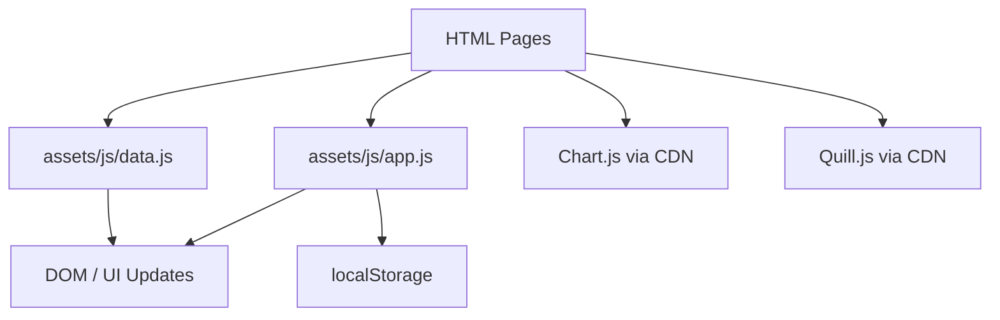

# UIU Research Portal

> A frontend prototype for an academic research collaboration platform for United International University (UIU) students.

The **UIU Research Portal** brings research-oriented collaboration workflows into a single web interface. The current repository is a **client-side, frontend-only implementation** with static HTML pages, CSS styling, vanilla JavaScript, mock data, and selected CDN-hosted UI libraries.

The prototype is designed around the flow from **finding research partners and ideas to managing projects, sharing research resources and datasets, writing papers, communicating with teammates, and tracking contributions and reputation**.

---

## Table of Contents

- [Project Status](#project-status)
- [Features](#features)
- [Tech Stack](#tech-stack)
- [Architecture](#architecture)
- [Project Structure](#project-structure)
- [Pages](#pages)
- [Getting Started](#getting-started)
- [External Dependencies](#external-dependencies)
- [Data & State Management](#data--state-management)
- [Authentication in the Current Prototype](#authentication-in-the-current-prototype)
- [Core Workflows](#core-workflows)
- [UI/UX](#uiux)
- [Testing](#testing)
- [Known Limitations](#known-limitations)
- [Planned Backend Transition](#planned-backend-transition)
- [Technical Documentation](#technical-documentation)
- [License](#license)

---

## Project Status

**Current phase: Frontend prototype / Phase 1**

The repository currently contains:

- 19 HTML pages
- 3 CSS files
- 2 JavaScript files
- Mock application data stored in `assets/js/data.js`
- Client-side interactions implemented with vanilla JavaScript
- Chart.js visualizations for contribution/reputation analytics
- Quill.js-based research editor
- Light/dark theme switching with browser `localStorage`

There is **no backend server, real database, package manager configuration, or server-side API implementation in this repository**. The PHP/MySQL architecture described in the project documentation is a planned Phase 2 transition rather than the current implementation.

---

## Features

### Research collaboration

- Find potential research collaborators by skills, interests, department, academic year, and availability.
- View collaborator profiles and collaboration-oriented actions.
- Post collaboration requests.

### Research project management

- Browse active and completed projects.
- View project progress, members, tasks, milestones, tags, and deadlines.
- Project workspace with a Kanban-style task board.
- Project activity and member contribution views.

### Innovation Hub

- Browse research ideas.
- Search/filter ideas.
- Upvote ideas.
- Send requests to join an idea/project.

### Research resources & datasets

- Browse academic resources such as papers, study materials, tutorials, and PDFs.
- Browse datasets, experiment outputs, and code-oriented resources.
- Search/filter resource and dataset cards.
- Prototype upload/download/fork/bookmark actions are represented through client-side UI interactions.

### Collaborative research editor

- Rich-text research writing interface powered by Quill.js.
- Formatting toolbar for headings, emphasis, lists, blockquotes, links, alignment, and code blocks.
- Citation insertion interaction.
- Comment interaction.
- Version-history style interface.
- Export-action interface for PDF, DOCX, LaTeX, and Markdown.

### Community & communication

- Direct-message and group-conversation interface.
- Notifications center.
- Research blog and article view.
- Academic events and opportunity listings.

### Contribution & reputation system

- Contribution dashboard with Chart.js visualizations.
- Reputation point history.
- Leaderboard.
- Badge/achievement interface.

### UI features

- Responsive layout across desktop, tablet, and mobile breakpoints.
- Light/dark theme toggle.
- Reusable sidebar and topbar generated through JavaScript.
- Reusable modal, tab, dropdown, toast, counter, and scroll-reveal utilities.
- Inline SVG icon library instead of an external icon-font dependency.

---

## Tech Stack

| Layer | Technology | Usage |
|---|---|---|
| Markup | HTML5 | Page structure and UI markup |
| Styling | CSS3 | Layout, design system, components, animation and responsive behavior |
| Client logic | Vanilla JavaScript (ES6+) | Rendering, UI state, interactions and navigation helpers |
| Charts | Chart.js | Contribution and reputation charts |
| Rich-text editing | Quill.js 1.3.7 | Research editor |
| Fonts | Google Fonts | Inter and Lora |
| Persistence | Browser `localStorage` | Light/dark theme preference only |
| Data source | JavaScript object store | Mock application data in `assets/js/data.js` |

No `package.json`, `composer.json`, `pom.xml`, `build.gradle`, Docker configuration, `.env` configuration, or SQL schema was found in the repository.

---

## Architecture

The current application follows a simple client-side architecture:



### Current data flow

1. Each HTML page defines the page-specific structure.
2. `assets/js/data.js` exposes a global `DATA` object containing mock users, projects, tasks, resources, datasets, ideas, events, messages, notifications, contribution data, leaderboard entries, and badges.
3. `assets/js/app.js` provides shared client-side behavior such as theme switching, sidebar handling, modals, tabs, dropdowns, toast notifications, counters, scroll reveal, search filtering helpers, date formatting, and inline SVG icons.
4. Page-level scripts read values from `DATA` and inject dynamic content into the DOM.
5. User interactions update in-memory JavaScript state or show a simulated success/info message. Most changes are not persisted after reload.
6. The selected theme is persisted through `localStorage` under the key `uiu-theme`.

---

## Project Structure

```text
UIU-Research-Portal-main/
├── README.md
└── UIU Research Portal/
    ├── index.html
    ├── Technical_Documentation.md
    ├── project plan.md
    ├── assets/
    │   ├── css/
    │   │   ├── global.css
    │   │   ├── components.css
    │   │   └── animations.css
    │   └── js/
    │       ├── app.js
    │       └── data.js
    ├── auth/
    │   ├── login.html
    │   └── register.html
    ├── blog/
    │   ├── index.html
    │   └── post.html
    ├── collaborators/
    │   └── index.html
    ├── contributions/
    │   └── index.html
    ├── dashboard/
    │   └── index.html
    ├── datasets/
    │   └── index.html
    ├── editor/
    │   └── index.html
    ├── events/
    │   └── index.html
    ├── ideas/
    │   └── index.html
    ├── messages/
    │   └── index.html
    ├── notifications/
    │   └── index.html
    ├── profile/
    │   └── index.html
    ├── projects/
    │   ├── index.html
    │   └── workspace.html
    ├── reputation/
    │   └── index.html
    └── resources/
        └── index.html
```

### Important files

| File | Responsibility |
|---|---|
| `UIU Research Portal/index.html` | Public landing page |
| `UIU Research Portal/assets/js/app.js` | Shared application utilities and UI behavior |
| `UIU Research Portal/assets/js/data.js` | Mock data store used by the prototype |
| `UIU Research Portal/assets/css/global.css` | Global styles, variables/tokens, typography and base layout |
| `UIU Research Portal/assets/css/components.css` | Reusable UI component styles |
| `UIU Research Portal/assets/css/animations.css` | Animation/keyframe styles |
| `UIU Research Portal/Technical_Documentation.md` | Detailed logic, architecture and Phase 2 backend notes |
| `UIU Research Portal/project plan.md` | Project planning material |

---

## Pages

| Module | Page | Purpose |
|---|---|---|
| Public | `index.html` | Landing/overview page |
| Authentication | `auth/login.html` | Sign-in UI and demo-login flow |
| Authentication | `auth/register.html` | Multi-step registration UI |
| Dashboard | `dashboard/index.html` | Personalized research overview |
| Profile | `profile/index.html` | Academic profile, skills, badges and activity |
| Collaboration | `collaborators/index.html` | Search and browse research collaborators |
| Projects | `projects/index.html` | Browse and filter projects |
| Projects | `projects/workspace.html` | Project workspace and Kanban-style tasks |
| Innovation | `ideas/index.html` | Research idea discovery and upvoting |
| Resources | `resources/index.html` | Research resource hub |
| Datasets | `datasets/index.html` | Dataset and experiment hub |
| Editor | `editor/index.html` | Rich-text research editor |
| Community | `blog/index.html` | Blog and knowledge-sharing feed |
| Community | `blog/post.html` | Individual research article view |
| Community | `events/index.html` | Events and opportunities |
| Communication | `messages/index.html` | Direct and group conversations |
| Notifications | `notifications/index.html` | Alerts and updates |
| Analytics | `contributions/index.html` | Contribution charts and member breakdown |
| Analytics | `reputation/index.html` | Reputation points, badges and leaderboard |

---

## Getting Started

### Option 1: Open directly in a browser

No build step is required.

1. Open the `UIU Research Portal` directory.
2. Open `index.html` in a modern browser such as Chrome, Edge, Firefox, or Safari.
3. Use the landing page to navigate through the prototype.

Because Chart.js, Quill.js, and Google Fonts are loaded from CDNs, an internet connection is recommended for all external assets to load correctly.

### Option 2: Run with a local static server

Serving the site over HTTP is a better development setup for testing relative links and browser behavior.

From the `UIU Research Portal` directory:

```bash
python -m http.server 8000
```

Then open:

```text
http://localhost:8000/
```

> Python is not a project dependency; it is only one convenient way to run the static files through a local HTTP server.

---

## External Dependencies

The project does not use a package manager in the current repository. External libraries/assets are loaded directly from CDNs.

### Chart.js

Used on:

- `contributions/index.html`
- `reputation/index.html`

CDN:

```text
https://cdn.jsdelivr.net/npm/chart.js
```

### Quill.js 1.3.7

Used on:

- `editor/index.html`

CDNs:

```text
https://cdn.quilljs.com/1.3.7/quill.min.js
https://cdn.quilljs.com/1.3.7/quill.snow.css
```

### Google Fonts

The global stylesheet imports:

- Inter
- Lora

CDN:

```text
https://fonts.googleapis.com/
```

---

## Data & State Management

### Mock data store

`assets/js/data.js` contains a global `DATA` object that acts as the prototype's in-memory data source.

It includes entities such as:

- `currentUser`
- `students`
- `projects`
- `tasks`
- `resources`
- `datasets`
- `blogs`
- `ideas`
- `events`
- `conversations`
- `notifications`
- `leaderboard`
- `contributions`
- `reputationPoints`
- `badges`

Helper methods such as `getStudent()` and `getProject()` provide simple lookup functionality.

### Persistence behavior

Most interactions only modify client-side state for the current page/session and reset when the page is reloaded because there is no backend database.

The main persistent browser state is the UI theme:

```javascript
localStorage.getItem('uiu-theme')
localStorage.setItem('uiu-theme', next)
```

---

## Authentication in the Current Prototype

Authentication is currently **simulated** and does not verify users against a server or database.

### Login

- The login form checks whether the entered email ends with `@uiu.ac.bd`.
- Successful submission shows a loading state and redirects to the dashboard after a short delay.
- A dedicated **Demo Student (Rafsan Ahmed)** action also redirects to the dashboard.

### Registration

The registration UI is a three-step wizard covering:

1. Account details
2. Academic profile information
3. Skills, research interests, and collaboration goals

The UI performs a frontend-only UIU email-domain check using `@uiu.ac.bd` and then shows a simulated account-creation success state before redirecting to the dashboard.

No server-side password storage, session handling, database authentication, email verification, or authorization service is implemented in the current repository.

---

## Core Workflows

### Find collaborators

```text
Collaborator page
      ↓
Search/filter input
      ↓
Client-side filtering of rendered cards
      ↓
View available profile/action controls
```

### Project workspace

```text
Projects
   ↓
Open Workspace
   ↓
View project metadata
   ↓
View Kanban-style task columns
   ↓
Interact with task/file/member controls
```

### Research editor

```text
Research Editor
      ↓
Quill.js rich-text editor
      ↓
Edit content / insert citation / add comment
      ↓
Client-side autosave-style UI feedback
```

The editor's autosave indicator is simulated in the browser; it does not write a document to a server.

### Contributions & reputation

```text
Mock DATA
   ↓
Page-level JavaScript
   ↓
Chart.js / UI rendering
   ↓
Contribution charts, points and leaderboard
```

---

## UI/UX

The design system is implemented with reusable CSS variables and shared components.

### Themes

- Light theme
- Dark theme
- Theme preference persisted in `localStorage`

### Typography

- **Inter** for general interface/body text
- **Lora** for major headings

### Interaction patterns

- Reusable sidebar
- Topbar navigation
- Modal manager
- Toast notifications
- Tabs
- Dropdown menus
- Scroll-reveal animations using `IntersectionObserver`
- Animated numeric counters
- Responsive card/grid layouts
- Inline SVG icon system

The stylesheet uses CSS custom properties for shared colors, spacing, surfaces, borders, typography, shadows, radii, and transition timings.

---

## Testing

No automated test suite, test runner, or dedicated test configuration was found in the repository.

Current validation is therefore primarily manual through browser interaction and page navigation.

For local verification, check at minimum:

- All navigation links resolve correctly.
- Login and registration demo flows redirect to the dashboard.
- Theme switching works and persists after reload.
- Search/filter interfaces update visible cards.
- Modals, tabs, dropdowns, toast notifications, and responsive sidebar interactions work.
- Chart.js pages render when the CDN is reachable.
- Quill.js loads correctly on the Research Editor page.

---

## Known Limitations

The current repository is a prototype, so several interactions are intentionally simulated.

- No backend API layer is present.
- No real database is connected.
- No real user/session authentication exists.
- Registration does not create a persistent account.
- Passwords are not stored or verified.
- Project/task/resource/dataset changes are not persisted to a server.
- File upload/download operations are UI simulations rather than real file transfers.
- Messaging is a frontend conversation interface; real-time delivery is not implemented.
- Notification state is client-side only.
- Research editor autosave is simulated and does not persist documents remotely.
- Several actions display “coming soon”, success, or informational toast messages instead of performing server-side operations.
- External CDN access is required for Chart.js, Quill.js, and Google Fonts.

---

## Planned Backend Transition

The repository's technical documentation describes a **Phase 2 full-stack transition**. These items are planning information and are **not part of the current implementation**.

The documented target architecture includes:

- PHP 8.1+
- MySQL 8.0+
- PDO for parameterized database queries
- PHP sessions and secure password hashing
- PHPMailer for UIU-domain email verification
- WebSockets/polling for real-time communication
- Server-side APIs replacing direct access to the mock `DATA` object
- Persistent file storage for resources and datasets

The planned migration path is conceptually:

```text
Current Phase
HTML + CSS + Vanilla JS + DATA object
                ↓
        PHP API / server layer
                ↓
             MySQL
                ↓
Persistent authentication, projects,
messages, resources, datasets, etc.
```

The implementation roadmap described in `Technical_Documentation.md` covers database design, authentication, profiles, projects/tasks, content hubs, interaction systems, real-time features, analytics/reputation, security, and deployment.

---

## Technical Documentation

For a deeper explanation of current logic and the planned backend architecture, see:

- [`UIU Research Portal/Technical_Documentation.md`](UIU%20Research%20Portal/Technical_Documentation.md)
- [`UIU Research Portal/project plan.md`](UIU%20Research%20Portal/project%20plan.md)

The technical documentation explains the shared JavaScript managers, mock data structure, module workflows, UI/UX implementation details, and Phase 2 backend transition plan.

---

## License

No license has been specified in the repository.

---

## Credits

**United International University (UIU)**  
**Project:** UIU Research Portal  
**Current release context:** Frontend prototype / Phase 1
