# UIU Research Portal — Database Architecture & Schema

## Overview
- **Database Engine:** MySQL 8.0+ / MariaDB 10.4+
- **Character Set:** `utf8mb4`
- **Collation:** `utf8mb4_unicode_ci`
- **Total Tables:** 31 tables

---

## Entity Relationship Diagram

```mermaid
erDiagram
    users ||--o{ user_skills : has
    users ||--o{ user_interests : has
    users ||--o{ user_looking_for : seeks
    users ||--o{ projects : creates
    users ||--o{ project_members : participates
    projects ||--o{ project_members : includes
    projects ||--o{ project_tags : tagged_with
    projects ||--o{ tasks : contains
    users ||--o{ tasks : assigned_to
    users ||--o{ conversation_participants : joins
    conversations ||--o{ conversation_participants : has
    conversations ||--o{ messages : holds
    users ||--o{ messages : sends
    users ||--o{ resources : publishes
    resources ||--o{ resource_tags : tagged_with
    users ||--o{ blog_posts : writes
    blog_posts ||--o{ blog_comments : has
    blog_posts ||--o{ blog_likes : receives
    users ||--o{ ideas : submits
    ideas ||--o{ idea_upvotes : receives
    ideas ||--o{ idea_comments : has
    events ||--o{ event_registrations : receives
    users ||--o{ event_registrations : attends
    badges ||--o{ user_badges : awarded_to
    users ||--o{ user_badges : possesses
    users ||--o{ notifications : receives
    projects ||--o{ contributions : records
```

---

## Key Table Definitions

### 1. `users`
| Column | Type | Nullable | Details |
|---|---|---|---|
| `id` | INT AUTO_INCREMENT | No | Primary Key |
| `name` | VARCHAR(150) | No | Full Name |
| `email` | VARCHAR(191) | No | Unique index |
| `password_hash`| VARCHAR(255) | No | BCRYPT hash |
| `department` | VARCHAR(100) | Yes | CSE, EEE, BBA, ME, etc. |
| `academic_year`| VARCHAR(50) | Yes | 1st, 2nd, 3rd, 4th Year |
| `role` | VARCHAR(50) | No | Default: Student |
| `reputation` | INT | No | Default: 0 |
| `status` | ENUM | No | online, offline, away |
| `created_at` | DATETIME | No | Timestamp |
| `deleted_at` | DATETIME | Yes | Soft delete |

### 2. `projects`
| Column | Type | Nullable | Details |
|---|---|---|---|
| `id` | INT AUTO_INCREMENT | No | Primary Key |
| `title` | VARCHAR(255) | No | Project Title |
| `description` | TEXT | Yes | Project Overview |
| `domain` | VARCHAR(100) | Yes | AI/Healthcare, IoT, etc. |
| `status` | ENUM | No | planning, active, writing, under_review, completed |
| `progress` | INT | No | Percentage (0-100) |
| `deadline` | DATE | Yes | Due date |
| `visibility` | ENUM | No | public, private |
| `created_by` | INT | No | FK -> users(id) |

### 3. `tasks`
| Column | Type | Nullable | Details |
|---|---|---|---|
| `id` | INT AUTO_INCREMENT | No | Primary Key |
| `project_id` | INT | No | FK -> projects(id) |
| `title` | VARCHAR(255) | No | Task Title |
| `status` | ENUM | No | backlog, todo, in_progress, review, done |
| `priority` | ENUM | No | low, medium, high, urgent |
| `assignee_id` | INT | Yes | FK -> users(id) |
| `due_date` | DATE | Yes | Due date |

### 4. `resources`
| Column | Type | Nullable | Details |
|---|---|---|---|
| `id` | INT AUTO_INCREMENT | No | Primary Key |
| `title` | VARCHAR(255) | No | Resource/Dataset Title |
| `type` | VARCHAR(50) | No | Paper, Dataset, Code, Study Material |
| `category` | VARCHAR(100) | Yes | AI/ML, NLP, EEE, Statistics |
| `user_id` | INT | Yes | FK -> users(id) |
| `author_name` | VARCHAR(150) | Yes | Original Author |
| `downloads_count`| INT | No | Download Counter |
| `rating` | DECIMAL(3,2) | No | 0.00 to 5.00 |
| `file_path` | VARCHAR(255) | Yes | Storage file path |

---

## Indexes & Constraints
- Unique constraint on `users(email)`
- Composite unique on `project_members(project_id, user_id)`
- Composite unique on `idea_upvotes(idea_id, user_id)`
- Composite unique on `blog_likes(post_id, user_id)`
- Composite unique on `event_registrations(event_id, user_id)`
- Composite unique on `user_badges(user_id, badge_id)`
- Foreign keys with `ON DELETE CASCADE` for child items
